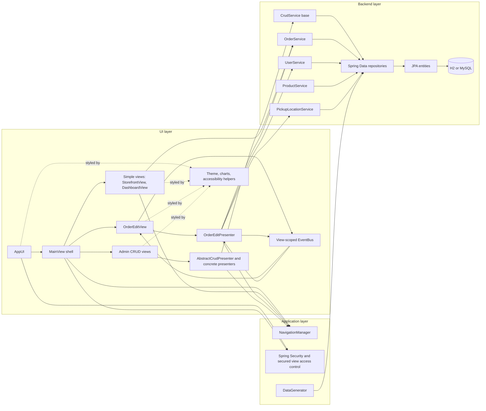

# Application Architecture

Bakery is a single-module Spring Boot application with a server-side Vaadin 8
UI. The codebase is organized by responsibility rather than by separate Maven
modules.

## Layering (typical call flow)

`View (Vaadin UI) -> Presenter or View logic -> Service -> Repository -> Database`

Cross-cutting concerns:

- Spring Security protects HTTP routes and Vaadin secured views.
- Shared UI shell and navigation live in the `ui` package.
- Theme, charts, and custom accessibility helpers live in UI-side resources and
  components.
- A Vaadin view-scoped event bus coordinates internal updates inside the order
  editing flow.

## Package-level structure

- `com.vaadin.starter.bakery.app`
  - application bootstrap
  - shared configuration
  - demo data generation
  - security configuration
- `com.vaadin.starter.bakery.ui`
  - UI root
  - main shell
  - navigation
  - theme-specific UI helpers
- `com.vaadin.starter.bakery.ui.views`
  - dashboard view
  - storefront view
  - order editing view and presenter
  - admin CRUD views and presenters
- `com.vaadin.starter.bakery.backend`
  - Spring Data repositories
- `com.vaadin.starter.bakery.backend.service`
  - domain services
  - shared CRUD service abstraction
- `com.vaadin.starter.bakery.backend.data`
  - enums and DTO-style analytics objects
- `com.vaadin.starter.bakery.backend.data.entity`
  - JPA entities

## Mermaid diagram

## Architectural patterns used

### 1. Mixed simple-view and presenter-based UI

- `MainView`, `StorefrontView`, and `DashboardView` keep behavior directly in
  the view because their logic is relatively small.
- `OrderEditView` delegates non-trivial workflow behavior to
  `OrderEditPresenter`.
- Admin views share a generic CRUD foundation through `AbstractCrudView` and
  `AbstractCrudPresenter`.

This is a pragmatic architecture rather than a strict all-MVP design.

### 2. Shared CRUD framework for admin screens

- Product and user admin screens reuse a generic CRUD presenter/view base.
- The shared layer handles:
  - form binding
  - selection state
  - save/delete/cancel behavior
  - unsaved-change confirmation
  - filtering

This reduces repeated UI logic while keeping entity-specific binding in the
concrete views.

### 3. Security split across HTTP and view layers

- Spring Security protects all URLs except login and static Vaadin assets.
- Vaadin `SecuredViewAccessControl` controls whether users can access secured
  views and whether navigation buttons are visible.
- Admin CRUD views inherit `@Secured(Role.ADMIN)` from the shared admin base
  view.

### 4. Repository-driven domain services

- Services encapsulate business logic and queries rather than placing that logic
  directly in views.
- `OrderService` owns:
  - order persistence
  - state transitions
  - history creation
  - dashboard analytics assembly
- `UserService` owns user persistence and password encoding concerns.

### 5. View-scoped event bus for local coordination

- The order editing flow uses the Vaadin Spring event bus in view scope.
- It coordinates updates such as:
  - order item changes affecting totals
  - order item deletion
  - order history refresh notifications
- This is a local UI coordination mechanism, not a distributed eventing system.

## Runtime and deployment model

- Packaging is a WAR artifact.
- The application can run via `mvn spring-boot:run` or as an executable WAR.
- Development mode relies on Spring Boot defaults and an embedded H2 database.
- Production properties target MySQL and enable Vaadin production mode.

## Key infrastructure choices

- UI framework: Vaadin 8.31.1
- Application framework: Spring Boot 2.7.18
- Security: Spring Security + Vaadin Spring Security integration
- Persistence: Spring Data JPA
- Database:
  - H2 by default
  - MySQL in production profile/properties
- Charts: Vaadin Charts
- Layout helper: Vaadin Board
- Validation: Bean Validation with Vaadin binders

## Architectural boundaries and tradeoffs

- The codebase favors practical reuse over rigid purity.
- Not all views use presenters; simple screens keep logic inline.
- The app is intentionally sample-sized and keeps domain logic close to the UI
  where that reduces overhead.
- There is no evidence of formal architecture enforcement tooling such as
  ArchUnit in this repository; boundaries are maintained mainly by package
  structure and coding style.
