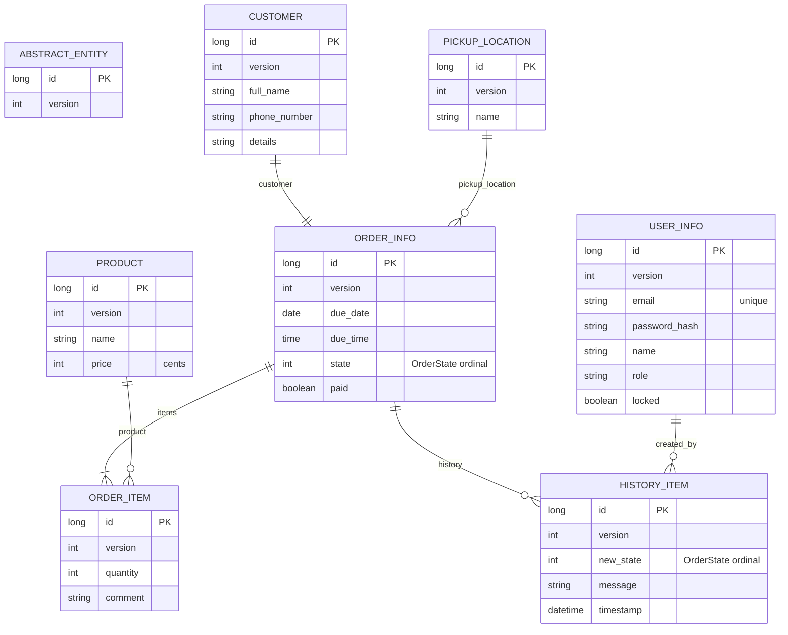

# Bakery backend data model

This model is derived from the current JPA entities under
`src/main/java/com/vaadin/starter/bakery/backend/data/entity`.

## Notes / interpretation

- Persistent JPA entities: `User`, `Product`, `Customer`, `PickupLocation`,
  `Order`, `OrderItem`, `HistoryItem`.
- All entities inherit from `AbstractEntity`, which provides:
  - generated `id`
  - optimistic-lock `version`
- `User.role` is stored as a string value such as `admin`, `baker`, or
  `barista`.
- `Order.state` and `HistoryItem.newState` are enum fields without explicit
  `@Enumerated`, so the default JPA ordinal mapping applies unless the provider
  is reconfigured.
- `Product.price` is stored as integer cents.
- `Order.customer` is a dedicated persisted entity linked with a one-to-one
  association.
- `Order.items` is a one-to-many collection of `OrderItem` loaded eagerly.
- `Order.history` is a one-to-many collection of `HistoryItem` loaded lazily.
- `Order.pickupLocation` is a many-to-one association.
- `OrderItem.product` and `HistoryItem.createdBy` are many-to-one associations.
- `Order` defines two named entity graphs:
  - `Order.gridData` loads customer data for list/grid views.
  - `Order.allData` loads customer, items, and history for detail views.
- Explicit uniqueness currently exists on `User.email`.
- Development persistence defaults to H2. Production properties point to MySQL.

## ER diagram (Mermaid)

## Relationship details

### Order aggregate

- `Order` is the central aggregate for operational workflows.
- It combines schedule data, customer information, pickup location, payment
  status, line items, and lifecycle history.
- Cascade behavior means saving or deleting an order also affects its related
  customer, items, and history.

### Customer handling

- Customer data is modeled as its own entity rather than embedded fields on the
  order.
- In the current implementation, each order owns its customer reference rather
  than linking to a reusable customer master record.

### Order history

- `HistoryItem` captures lifecycle transitions and comments.
- Each history item stores:
  - the acting user
  - a message
  - a timestamp
  - optionally the resulting order state

### User model

- `User` is both a persisted business object and the basis for Spring Security
  authentication.
- `locked` is part of the persisted model and is surfaced in the admin UI.

## Query and loading considerations

- Order listing queries support filtering by customer name and due date.
- Dashboard queries aggregate delivered orders by month, day, and product.
- Entity graphs are used to avoid loading the full order aggregate for grid-only
  views.
- Eager loading of order items is acceptable in the current sample because
  order sizes are small and bounded.

## Storage notes

- Default development runtime uses H2 through Spring Boot auto-configuration.
- Production configuration expects a MySQL datasource.
- All entities participate in optimistic locking through the shared `version`
  column.
